# CBOS Master ERD

## Version 1.0

## Purpose
This document defines the conceptual master entity relationship model for CBOS. It unifies the domain model, entity model, configuration engine, workflow engine, and industry pack architecture into one tenant-safe master data model.

The model is:
- project centric
- organization scoped
- event driven
- metadata driven
- industry extensible
- audit first

---

## Frozen Architectural Decisions
1. Projects may exist with or without Clients.
   - `organization_id` mandatory
   - `client_id` optional
   - `engagement_id` optional
2. Assets support dual ownership.
   - Organization Asset Library
   - Project Asset Library
3. Teams are many-to-many.
   - User ↔ Team
4. Projects support one Primary Branch and many Supporting Branches.
5. Clients support multiple Contacts.
   - Client → Contact (1:N)
6. Projects may be instantiated from Project Templates.
   - Business Template → Project Template → Project
7. All entities are organization scoped.
   - `organization_id` mandatory
8. Soft delete is mandatory.
9. Audit logging is mandatory.
10. No cross-tenant access is permitted.

---

## Master Conceptual ERD

```mermaid
erDiagram
    ORGANIZATION ||--o{ BRANCH : owns
    ORGANIZATION ||--o{ TEAM : owns
    ORGANIZATION ||--o{ USER : owns
    ORGANIZATION ||--o{ ROLE : owns
    ORGANIZATION ||--o{ LEAD : owns
    ORGANIZATION ||--o{ CLIENT : owns
    ORGANIZATION ||--o{ PROJECT : owns
    ORGANIZATION ||--o{ ASSET : owns_library_assets
    ORGANIZATION ||--o{ CAMPAIGN : owns
    ORGANIZATION ||--o{ WORKFLOW_DEFINITION : owns
    ORGANIZATION ||--o{ CONFIGURATION_PACKAGE : owns
    ORGANIZATION ||--o{ BUSINESS_TEMPLATE : owns_installed_copy
    ORGANIZATION ||--o{ BILLING_ACCOUNT : owns
    ORGANIZATION ||--o{ AI_SESSION : owns
    ORGANIZATION ||--o{ ANALYTICS_SNAPSHOT : owns

    USER ||--o{ USER_ROLE : assigned
    ROLE ||--o{ USER_ROLE : grants
    ROLE ||--o{ ROLE_PERMISSION : contains
    PERMISSION ||--o{ ROLE_PERMISSION : maps
    USER ||--o{ USER_TEAM : assigned
    TEAM ||--o{ USER_TEAM : contains

    LEAD ||--o| OPPORTUNITY : converts_to
    LEAD ||--o{ QUOTE : requests
    LEAD }o--|| CAMPAIGN : sourced_from

    CLIENT ||--o{ CONTACT : has
    CLIENT ||--o{ ENGAGEMENT : has
    CLIENT ||--o{ PROJECT : may_reference
    CLIENT ||--o{ QUOTE : billed_to
    CLIENT ||--o{ CONVERSATION : participates_in

    ENGAGEMENT ||--o{ PROJECT : contains

    BRANCH ||--o{ PROJECT : primary_for
    PROJECT ||--o{ PROJECT_BRANCH : supported_by
    BRANCH ||--o{ PROJECT_BRANCH : supports
    PROJECT ||--o{ SUB_PROJECT : decomposes_to
    PROJECT ||--o{ TASK : contains
    PROJECT ||--o{ SHOOT : schedules
    PROJECT ||--o{ GALLERY : publishes
    PROJECT ||--o{ DELIVERABLE : produces
    PROJECT ||--o{ ASSET : owns_project_assets
    PROJECT ||--o{ EXPENSE : incurs
    PROJECT ||--o{ INVOICE : bills
    PROJECT ||--o{ CONVERSATION : contains
    PROJECT ||--o{ WORKFLOW_EXECUTION : orchestrates

    SHOOT ||--o{ SHOOT_SETUP : requires
    GALLERY ||--o{ GALLERY_ASSET : contains
    ASSET ||--o{ GALLERY_ASSET : appears_in
    DELIVERABLE ||--o{ DELIVERABLE_ASSET : packages
    ASSET ||--o{ DELIVERABLE_ASSET : included_in

    INVOICE ||--o{ PAYMENT_ALLOCATION : allocated_by
    PAYMENT ||--o{ PAYMENT_ALLOCATION : allocates

    CONVERSATION ||--o{ MESSAGE : contains

    CONFIGURATION_PACKAGE ||--o{ PROJECT_TYPE : defines
    CONFIGURATION_PACKAGE ||--o{ FIELD_DEFINITION : defines
    FIELD_DEFINITION ||--o{ FIELD_OPTION : offers
    FIELD_DEFINITION ||--o{ FIELD_VALUE : stores
    CONFIGURATION_PACKAGE ||--o{ STATUS_DEFINITION : defines
    CONFIGURATION_PACKAGE ||--o{ FORM_DEFINITION : defines
    FORM_DEFINITION ||--o{ FORM_FIELD : arranges
    FORM_DEFINITION ||--o{ FORM_SUBMISSION : records
    CONFIGURATION_PACKAGE ||--o{ PERMISSION_SET : defines
    PERMISSION_SET ||--o{ PERMISSION_SET_ITEM : contains

    BUSINESS_TEMPLATE ||--o{ BUSINESS_TEMPLATE_VERSION : versions
    BUSINESS_TEMPLATE ||--o{ PROJECT_TEMPLATE : supplies
    BUSINESS_TEMPLATE_VERSION ||--o{ TEMPLATE_MODULE : contains
    PROJECT_TEMPLATE ||--o{ PROJECT : instantiates

    WORKFLOW_DEFINITION ||--o{ WORKFLOW_VERSION : versions
    WORKFLOW_VERSION ||--o{ WORKFLOW_TRIGGER : activates
    WORKFLOW_VERSION ||--o{ WORKFLOW_CONDITION_GROUP : groups
    WORKFLOW_CONDITION_GROUP ||--o{ WORKFLOW_CONDITION : contains
    WORKFLOW_VERSION ||--o{ WORKFLOW_ACTION : executes
    WORKFLOW_VERSION ||--o{ WORKFLOW_TRANSITION_RULE : branches
    WORKFLOW_DEFINITION ||--o{ WORKFLOW_EXECUTION : runs
    WORKFLOW_EXECUTION ||--o{ WORKFLOW_EXECUTION_STEP : tracks
    WORKFLOW_EXECUTION ||--o{ WORKFLOW_EXECUTION_EVENT : emits
    WORKFLOW_EXECUTION ||--o{ WORKFLOW_RETRY : retries
    WORKFLOW_EXECUTION ||--o| DEAD_LETTER_ENTRY : fails_to
    WORKFLOW_EXECUTION ||--o{ WORKFLOW_APPROVAL : requests

    BILLING_ACCOUNT ||--|| SUBSCRIPTION : current_plan
    BILLING_ACCOUNT ||--o{ BILLING_INVOICE : billed_by_platform

    ANALYTICS_METRIC ||--o{ ANALYTICS_SNAPSHOT : materializes
    DOMAIN_EVENT ||--o{ ANALYTICS_SNAPSHOT : feeds

    AI_SESSION ||--o{ AI_RECOMMENDATION : produces
    AI_SESSION ||--o{ AI_ACTION_LOG : records
    DOMAIN_EVENT ||--o{ AI_SESSION : informs
```

---

## Entity Inventory by Domain

### Identity
| Entity | Purpose | Owner |
|---|---|---|
| User | Human actor operating within an organization | Organization |
| Role | Access control grouping | Organization |
| Permission | Permission record available within the tenant access model | Organization |
| UserRole | Many-to-many bridge between users and roles | Organization |
| Team | Operational grouping for routing and visibility | Organization |
| UserTeam | Many-to-many bridge between users and teams | Organization |
| RolePermission | Many-to-many bridge between roles and permissions | Organization |

### Organizations
| Entity | Purpose | Owner |
|---|---|---|
| Organization | Tenant root aggregate | Self |
| Branch | Physical or logical operating unit | Organization |
| ProjectBranch | Supporting branch assignment for projects | Project |
| BillingAccount | Commercial account for CBOS subscription billing | Organization |
| Subscription | Current plan and lifecycle state | BillingAccount |
| BillingInvoice | CBOS platform invoice | BillingAccount |

### CRM
| Entity | Purpose | Owner |
|---|---|---|
| Lead | Pre-client demand capture | Organization |
| Opportunity | Monetizable qualification record for a lead | Lead |
| Quote | Commercial proposal before or during execution | Organization |
| Campaign | Source and marketing grouping for demand generation | Organization |

### Clients
| Entity | Purpose | Owner |
|---|---|---|
| Client | Buying account or individual | Organization |
| Contact | Named point of contact for a client | Client |

### Engagements
| Entity | Purpose | Owner |
|---|---|---|
| Engagement | Commercial relationship container between client and work | Client |

### Projects
| Entity | Purpose | Owner |
|---|---|---|
| Project | Primary execution aggregate | Organization |
| SubProject | One-level child decomposition of a project | Project |
| ProjectTemplate | Reusable project blueprint derived from business templates | BusinessTemplate |

### Operations
| Entity | Purpose | Owner |
|---|---|---|
| Task | Actionable work item | Project |
| Shoot | Scheduled production activity | Project |
| ShootSetup | Setup definition for a shoot | Shoot |

### Media
| Entity | Purpose | Owner |
|---|---|---|
| Asset | Media object with dual ownership: organization library or project library | Organization or Project |
| Gallery | Curated client-facing or internal collection | Project |
| GalleryAsset | Many-to-many bridge between galleries and assets | Gallery |
| Deliverable | Delivered output package | Project |
| DeliverableAsset | Many-to-many bridge between deliverables and assets | Deliverable |

### Finance
| Entity | Purpose | Owner |
|---|---|---|
| Invoice | Customer receivable record | Project |
| Payment | Cash receipt or settlement event | Organization |
| PaymentAllocation | Many-to-many bridge between payments and invoices | Payment |
| Expense | Cost record incurred against project delivery | Project |

### Communications
| Entity | Purpose | Owner |
|---|---|---|
| Conversation | Threaded communication anchored to project, client, or both | Organization |
| Message | Individual communication item | Conversation |

### Workflow
| Entity | Purpose | Owner |
|---|---|---|
| WorkflowDefinition | Logical automation identity | Organization |
| WorkflowVersion | Immutable workflow configuration snapshot | WorkflowDefinition |
| WorkflowTrigger | Activation contract | WorkflowVersion |
| WorkflowConditionGroup | Nested boolean grouping | WorkflowVersion |
| WorkflowCondition | Atomic predicate | WorkflowConditionGroup |
| WorkflowAction | Configured action step | WorkflowVersion |
| WorkflowTransitionRule | Branching and wait logic | WorkflowVersion |
| WorkflowExecution | Runtime execution instance | WorkflowDefinition |
| WorkflowExecutionStep | Step-by-step runtime record | WorkflowExecution |
| WorkflowExecutionEvent | Immutable execution event trail | WorkflowExecution |
| WorkflowRetry | Retry attempt log | WorkflowExecution |
| DeadLetterEntry | Terminal failure record | WorkflowExecution |
| WorkflowApproval | Human approval checkpoint | WorkflowExecution |

### Configuration
| Entity | Purpose | Owner |
|---|---|---|
| ConfigurationPackage | Versioned bundle of tenant configuration | Organization |
| ProjectType | Configured project category | ConfigurationPackage |
| FieldDefinition | Custom metadata field definition | ConfigurationPackage |
| FieldOption | Option set item for select-style fields | FieldDefinition |
| FieldValue | Value for a configured field on a target entity | Organization |
| StatusDefinition | Tenant-defined lifecycle state | ConfigurationPackage |
| FormDefinition | Metadata-driven form | ConfigurationPackage |
| FormField | Ordered form composition record | FormDefinition |
| FormSubmission | Persisted submission against a form | FormDefinition |
| PermissionSet | Configured permission bundle | ConfigurationPackage |
| PermissionSetItem | Permission item in a set | PermissionSet |

### Business Templates
| Entity | Purpose | Owner |
|---|---|---|
| BusinessTemplate | Tenant-installed industry template shell | Organization |
| BusinessTemplateVersion | Immutable version used by the tenant | BusinessTemplate |
| TemplateModule | Logical module inside a template version | BusinessTemplateVersion |

### Billing
| Entity | Purpose | Owner |
|---|---|---|
| BillingAccount | Organization billing anchor for platform charges | Organization |
| Subscription | Active entitlement and renewal state | BillingAccount |
| BillingInvoice | Platform-generated invoice for subscription or usage | BillingAccount |

### Analytics
| Entity | Purpose | Owner |
|---|---|---|
| DomainEvent | Canonical event emitted by any aggregate mutation | Organization |
| AnalyticsMetric | Tenant-defined or platform-provided metric definition | Organization |
| AnalyticsSnapshot | Materialized metric state for dashboards and reports | Organization |

### AI
| Entity | Purpose | Owner |
|---|---|---|
| AISession | AI interaction context anchored to organization and user | Organization |
| AIRecommendation | AI suggestion, summary, prediction, or classification | AISession |
| AIActionLog | Audit trail of AI suggestions shown, accepted, or rejected | AISession |

---

## Aggregate Boundaries
| Aggregate Root | Included Entities | External References Allowed | Notes |
|---|---|---|---|
| Organization | Branch, Team, User, Role, BillingAccount, Subscription, ConfigurationPackage, BusinessTemplate, Campaign | References to platform permission codes only | Tenant root; every entity inherits organization ownership |
| Lead | Opportunity | Campaign, assigned User | Lead conversion may create Client and Project-side records |
| Client | Contact, Engagement | Project, Quote, Conversation | Client survives across multiple engagements and projects |
| Engagement | Project linkage metadata | Client, Project | Engagement optional on Project |
| Project | SubProject, Task, Shoot, ShootSetup, Gallery, Deliverable, Expense, Invoice, ProjectBranch, project-owned Asset, Conversation | optional Client, optional Engagement, ProjectTemplate, WorkflowExecution | Core execution aggregate |
| Invoice | PaymentAllocation | Project, Client, Payment | Payments may settle multiple invoices |
| Conversation | Message | Project, Client, Contact, User | Thread scope enforces tenant visibility |
| WorkflowDefinition | WorkflowVersion, Trigger, ConditionGroup, Condition, Action, TransitionRule | Configuration entities, ProjectType, StatusDefinition | Published versions immutable |
| WorkflowExecution | Step, Event, Retry, Approval, DeadLetterEntry | WorkflowDefinition, WorkflowVersion, Project, target entity | Runtime history immutable except resolution metadata |
| ConfigurationPackage | ProjectType, FieldDefinition, StatusDefinition, FormDefinition, PermissionSet | BusinessTemplate provenance, Organization | Versioned tenant configuration snapshot |
| BusinessTemplate | BusinessTemplateVersion, TemplateModule, ProjectTemplate | ConfigurationPackage provenance | Template registry data is copied into tenant scope |
| AISession | AIRecommendation, AIActionLog | User, DomainEvent, Project, Client | AI may recommend but not mutate sensitive data autonomously |

---

## Relationship Catalog

### One-to-One
| Relationship | Cardinality | Ownership Rule |
|---|---|---|
| BillingAccount ↔ active Subscription | 1:1 | BillingAccount owns current subscription lifecycle |
| Lead ↔ Opportunity | 1:0..1 | Lead owns the opportunity if qualification occurs |
| WorkflowExecution ↔ DeadLetterEntry | 1:0..1 | Execution owns dead-letter record when terminal failure occurs |

### One-to-Many
| Relationship | Cardinality | Ownership Rule |
|---|---|---|
| Organization → Branch | 1:N | Organization owns branch lifecycle |
| Organization → User | 1:N | Organization owns identity membership |
| Organization → Client | 1:N | Organization owns client portfolio |
| Client → Contact | 1:N | Client owns contacts |
| Client → Engagement | 1:N | Client owns engagements |
| Engagement → Project | 1:N | Engagement may own many projects; project link optional |
| Project → Task | 1:N | Project owns operational tasks |
| Project → Shoot | 1:N | Project owns shoots |
| Project → Gallery | 1:N | Project owns galleries |
| Project → Deliverable | 1:N | Project owns deliverables |
| Project → Invoice | 1:N | Project owns commercial billing artifacts |
| Invoice → PaymentAllocation | 1:N | Invoice participates in settlement allocations |
| Conversation → Message | 1:N | Conversation owns messages |
| WorkflowDefinition → WorkflowVersion | 1:N | Definition owns immutable versions |
| WorkflowExecution → WorkflowExecutionStep | 1:N | Execution owns step history |
| ConfigurationPackage → FieldDefinition | 1:N | Package owns metadata definitions |
| BusinessTemplate → ProjectTemplate | 1:N | Template owns reusable project blueprints |
| ProjectTemplate → Project | 1:N | Template may instantiate many projects |

### Many-to-Many
| Relationship | Cardinality | Bridge Entity | Ownership Rule |
|---|---|---|---|
| User ↔ Team | M:N | UserTeam | Organization owns membership |
| User ↔ Role | M:N | UserRole | Organization owns access assignment |
| Role ↔ Permission | M:N | RolePermission | Role owns effective permission mapping |
| Project ↔ Supporting Branch | M:N | ProjectBranch | Project owns supporting branch assignments |
| Gallery ↔ Asset | M:N | GalleryAsset | Gallery owns curation membership |
| Deliverable ↔ Asset | M:N | DeliverableAsset | Deliverable owns included asset membership |
| Payment ↔ Invoice | M:N | PaymentAllocation | Payment owns allocation movement |

---

## Cardinality Matrix
| Parent | Child | Cardinality | Mandatory on Child | Notes |
|---|---|---|---|---|
| Organization | Branch | 1:N | Yes | Branch cannot exist outside organization |
| Organization | Team | 1:N | Yes | Teams are tenant scoped |
| Organization | User | 1:N | Yes | User membership is tenant scoped |
| Organization | Lead | 1:N | Yes | CRM records are tenant scoped |
| Organization | Client | 1:N | Yes | Client ownership is tenant scoped |
| Organization | Project | 1:N | Yes | Project root requires organization_id |
| Organization | Asset | 1:N | Yes | Organization-owned assets use null project_id |
| Organization | WorkflowDefinition | 1:N | Yes | Workflow definitions are tenant owned |
| Organization | ConfigurationPackage | 1:N | Yes | Configuration is tenant owned |
| Client | Contact | 1:N | Yes | Required frozen decision |
| Client | Engagement | 1:N | Yes | Engagement anchored to client |
| Client | Project | 1:N (optional reference) | No | Project may exist without client |
| Engagement | Project | 1:N (optional reference) | No | Project may exist without engagement |
| Branch | Project (primary) | 1:N | Yes | Each project has one primary branch |
| Project | ProjectBranch | 1:N | No | Supporting branches optional |
| Branch | ProjectBranch | 1:N | Yes | Supporting branch assignment record |
| Project | SubProject | 1:N | Yes | One-level child only |
| Project | Task | 1:N | Yes | Task cannot exist outside project |
| Project | Shoot | 1:N | Yes | Shoot cannot exist outside project |
| Shoot | ShootSetup | 1:N | Yes | Setup belongs to one shoot |
| Project | Gallery | 1:N | Yes | Gallery belongs to one project |
| Project | Deliverable | 1:N | Yes | Deliverable belongs to one project |
| Project | Invoice | 1:N | Yes | Invoice belongs to one project |
| Invoice | PaymentAllocation | 1:N | Yes | Allocation row per invoice settlement |
| Payment | PaymentAllocation | 1:N | Yes | One payment can settle many invoices |
| Conversation | Message | 1:N | Yes | Message belongs to one conversation |
| WorkflowDefinition | WorkflowVersion | 1:N | Yes | Immutable history |
| WorkflowVersion | WorkflowAction | 1:N | Yes | Action belongs to one version |
| WorkflowExecution | WorkflowExecutionStep | 1:N | Yes | Step belongs to execution |
| BusinessTemplate | ProjectTemplate | 1:N | Yes | Template supplies blueprints |
| ProjectTemplate | Project | 1:N | No | Project may be ad hoc |

---

## Event Generation Matrix
| Aggregate / Entity | Core Events Generated |
|---|---|
| Organization | OrganizationCreated, OrganizationUpdated, OrganizationSuspended, SubscriptionChanged |
| Branch | BranchCreated, BranchUpdated, BranchArchived |
| User / Role / Team | UserInvited, UserActivated, RoleAssigned, TeamMembershipChanged |
| Lead | LeadCreated, LeadAssigned, LeadQualified, LeadConverted, LeadLost |
| Opportunity | OpportunityCreated, OpportunityUpdated, OpportunityClosed |
| Campaign | CampaignCreated, CampaignLaunched, CampaignClosed |
| Client | ClientCreated, ClientUpdated, ClientArchived |
| Contact | ContactAdded, ContactUpdated, ContactRemoved |
| Engagement | EngagementCreated, EngagementUpdated, EngagementClosed |
| Project | ProjectCreated, ProjectStarted, ProjectOnHold, ProjectCompleted, ProjectArchived |
| ProjectBranch | SupportingBranchAdded, SupportingBranchRemoved |
| Task | TaskCreated, TaskAssigned, TaskCompleted, TaskOverdue |
| Shoot | ShootScheduled, ShootRescheduled, ShootCompleted, ShootCancelled |
| Asset | AssetUploaded, AssetTagged, AssetArchived, AssetRestored |
| Gallery | GalleryCreated, GalleryPublished, GalleryDelivered, GalleryExpired |
| Deliverable | DeliverableCreated, DeliverableReady, DeliverableDelivered, DeliverableAccepted |
| Quote | QuoteCreated, QuoteSent, QuoteAccepted, QuoteRejected |
| Invoice | InvoiceGenerated, InvoiceSent, InvoiceOverdue, InvoiceVoided |
| Payment | PaymentReceived, PaymentAllocated, PaymentRefundRequested |
| Expense | ExpenseRecorded, ExpenseApproved, ExpenseRejected |
| Conversation / Message | ConversationOpened, MessageSent, MessageDelivered, MessageRead |
| ConfigurationPackage | ConfigurationDrafted, ConfigurationPublished, ConfigurationRolledBack |
| FieldDefinition / StatusDefinition / FormDefinition | FieldDefined, StatusDefined, FormPublished |
| BusinessTemplate | TemplateInstalled, TemplateUpgraded, TemplateRolledBack, TemplateUninstalled |
| ProjectTemplate | ProjectTemplatePublished, ProjectInstantiatedFromTemplate |
| WorkflowDefinition | WorkflowDefined, WorkflowPublished, WorkflowArchived, WorkflowRolledBack |
| WorkflowExecution | WorkflowTriggered, WorkflowStepCompleted, WorkflowFailed, WorkflowDeadLettered, WorkflowApproved |
| BillingAccount / Subscription | BillingAccountCreated, SubscriptionActivated, SubscriptionRenewed, SubscriptionCancelled |
| BillingInvoice | BillingInvoiceGenerated, BillingInvoicePaid, BillingInvoicePastDue |
| AnalyticsSnapshot | AnalyticsSnapshotCalculated, AnalyticsSnapshotCorrected |
| AISession / AIRecommendation | AISessionStarted, AIRecommendationGenerated, AIRecommendationAccepted, AIRecommendationRejected |

---

## Ownership Rules
1. Every persisted entity carries `organization_id`.
2. Organization is the tenancy owner for all runtime data.
3. Client owns Contacts and anchors Engagements.
4. Project owns operational and delivery entities.
5. Asset ownership is dual-mode:
   - organization-owned asset: `organization_id` present, `project_id` null
   - project-owned asset: `organization_id` present, `project_id` populated
6. WorkflowDefinition owns immutable WorkflowVersions.
7. WorkflowExecution owns runtime steps, retries, approvals, events, and dead-letter state.
8. ConfigurationPackage owns metadata definitions for statuses, fields, forms, permission sets, and project types.
9. BusinessTemplate owns ProjectTemplates and versioned template metadata copied into tenant scope.
10. Payments are organization owned but allocations bind them to project invoices.

---

## Multi-Tenant Rules
1. `organization_id` is mandatory on every runtime entity.
2. No read path may resolve records outside the requester's organization.
3. No write path may create or mutate records outside the requester's organization.
4. No foreign key or logical reference may cross tenant boundaries.
5. Workflow definitions, executions, retries, dead letters, and approvals are tenant isolated.
6. Configuration entities are copied into tenant scope; shared template catalogs never act as live cross-tenant references.
7. Analytics aggregates only consume events from the same organization.
8. AI sessions may only access organization-scoped context and must respect role and team visibility.
9. Platform operators may manage template distribution, but installed template data remains organization local.
10. Backup, export, purge, and restore operations must execute per tenant.

---

## Data Isolation Rules
1. Row-level isolation is mandatory by `organization_id`.
2. Aggregate roots may only reference other aggregates with the same `organization_id`.
3. Cross-tenant reporting is prohibited in operational analytics, workflow execution, AI context, communications, and finance.
4. Attachment, media, and export storage paths must be partitioned by organization.
5. Search indexes, caches, queues, and event streams must partition by organization.
6. Supporting branch assignments, team membership, and role grants cannot span organizations.
7. Soft-deleted records remain tenant visible only to authorized tenant users.
8. Tenant purge operations must never affect another tenant's live or archived data.

---

## Soft Delete Strategy
1. Every mutable business entity supports soft delete with `deleted_at` and `deleted_by` semantics.
2. Soft delete is the default removal mode for Organization-scoped data.
3. Soft-deleted parents do not hard-delete child records; children become inaccessible through normal reads.
4. Join entities such as UserTeam, UserRole, ProjectBranch, GalleryAsset, DeliverableAsset, and PaymentAllocation also support soft delete to preserve history.
5. WorkflowExecutionEvent, DomainEvent, AuditLog-style records, and financial settlement history are append-only and not physically removed during normal soft delete operations.
6. Restore is permitted only when referential integrity inside the same organization can be re-established.
7. Physical purge is a controlled retention action, never an interactive user delete.

---

## Audit Strategy
1. Create, update, delete, restore, publish, archive, rollback, approval, and allocation actions generate audit records.
2. Audit records capture:
   - actor
   - organization_id
   - entity_type
   - entity_id
   - action
   - timestamp
   - before state
   - after state
   - reason
   - correlation_id
3. WorkflowExecutionEvent is the audit trail for workflow runtime behavior.
4. DomainEvent is the audit/event source for cross-domain analytics and automation.
5. AIActionLog records what the AI suggested, what context it used, and whether a human accepted or rejected it.
6. Audit records are immutable and excluded from normal soft delete behavior.
7. Finance and billing mutations require stronger audit retention and approval linkage.

---

## Retention Strategy
| Data Class | Minimum Strategy |
|---|---|
| Organization, Client, Project master data | Retain while tenant active; purge only through approved tenant offboarding |
| Contacts, Conversations, Messages | Retain per contract and privacy policy; support legal hold |
| Assets, Galleries, Deliverables | Retain by organization policy and project retention rules |
| Leads, Opportunities, Quotes, Campaigns | Retain for sales analytics and attribution policy window |
| Invoices, Payments, Expenses, BillingInvoices | Retain for statutory finance and tax compliance window |
| Workflow definitions and versions | Retain indefinitely for rollback and audit |
| Workflow executions, retries, approvals, dead letters | Retain per operational audit policy; archive before purge |
| Configuration packages and template versions | Retain indefinitely while any dependent records exist |
| Domain events and audit logs | Retain as append-only history; archive to lower-cost storage when aged |
| AI sessions and recommendations | Retain per AI governance policy; redact sensitive prompts when required |
| Analytics snapshots | Rebuildable snapshots may be rotated; source audit events retained longer |

---

## Industry Coverage Without New Core Entities
The master ERD supports the following businesses without introducing new core entities:

### Photography Studios
Uses Project, Shoot, Asset, Gallery, Deliverable, Invoice, WorkflowDefinition, ProjectType, and ProjectTemplate.

### Marketing Agencies
Uses Project, Task, Campaign, Client, Deliverable, Invoice, WorkflowDefinition, StatusDefinition, and BusinessTemplate.

### Podcast Studios
Uses Project, Task, Asset, Deliverable, WorkflowDefinition, FormDefinition, and ProjectType.

### Production Houses
Uses Project, SubProject, Shoot, Asset, Expense, Deliverable, Invoice, WorkflowDefinition, and supporting Branch assignments.

Industry differences are expressed through:
- ProjectType
- FieldDefinition and FieldValue
- StatusDefinition
- FormDefinition
- WorkflowDefinition and WorkflowVersion
- BusinessTemplate and ProjectTemplate
- PermissionSet and tenant roles

---

## Master ERD Invariants
1. Project is the operational center of CBOS.
2. Every entity is organization scoped.
3. Client and Engagement references on Project are optional.
4. Every Project has exactly one primary Branch and zero to many supporting Branches.
5. Client owns one to many Contacts.
6. Teams are many-to-many with Users.
7. Assets support organization-level and project-level ownership without changing the Asset entity.
8. Business Templates extend behavior through metadata, not schema changes.
9. Soft delete, audit logging, and event generation are mandatory.
10. No cross-tenant access is allowed.

---

## Constitutional Statement
CBOS shall operate on a single conceptual master ERD in which Organization is the tenant root, Project is the execution root, configuration and workflow are metadata-driven, assets support dual ownership, and all industry variation is expressed through tenant-scoped templates and configuration rather than new core entities.
